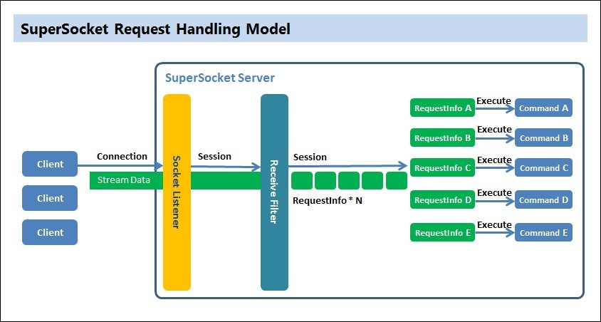

# {{ page.title }}
03 Aug 2013-Beijing
#SuperSocket的简要概述#
近几日想在一个项目中引进一个Socket Server，用来接收客户端发送的命令消息并根据具体的业务逻辑对消息进行处理，然后转发给其它在线的客户端。因为以前在博客园关注过江大渔开源的[SuperSocket](http://http://www.cnblogs.com/jzywh/)，后来便在[Github](https://github.com/kerryjiang/SuperSocket)和[Codeplex](https://supersocket.codeplex.com/)上一直关注该项目，但仅仅限于关注和了解。这次想通过具体的实践进一步学习该框架。我觉得一个优秀的开源项目离不开漂亮的代码、清晰的文档、完善的测试、持续的更新，当然从普通走向卓越更离不开社区的支持（源码、宣传、案例及文档等）。而SuperSocket对我个人而言是一个很优秀的开源项目，很值得去学习和应用。

在[官方介绍](http://docs.supersocket.net/v1-5/zh-CN)里，SuperSocket是一个轻量级、跨平台、可扩展的Socket应用框架。用户使用它可以很容易就构建出服务端Socket应用程序（如GPS Server、GIS Server、Game Server、FTP Server等），而不用去考虑关于Socket开发的具体细节（如socket如何使用，socket连接如何维护机器socket如何工作等）。常言“是骡子是马，拉出来溜溜。”，看看官方实现提供的文档实例以及源码中的QuickStart系列，就可以发现使用SuperSocket开发一个socket server，真是很方便。鉴于个人能力的问题，关于SuperSocket的使用和理解可能有所偏差，本文所述均为个人理解笔记。

#SuperSocket的基本认识#
##关于Server的一点想法##
Server是用来响应请求的，Ngnix、Apache、IIS作为Web Server，Oracle、MySQL、MongoDB、SQLServer作为数据库Server，不同的角色决定了其拥有的功能和关注的痛点。比如Web Server主要是用来响应Http[s]协议的请求，其职责是尽可能快响应浏览器发出的请求（如图片、CSS、JS等静态文件的下载，表单数据的提交处理等），所以Server首先要专注的自己的核心任务所在，提供高性能、高质量服务。关于我自己项目中的Server需求很简单，仅仅是个消息的转发中心而已。

##关于SuperSocket的数据处理流程的认识##
编写Web应用程序的时候，对从浏览器到Server中间发生的故事的了解程度反应了一个人对整个Web开发的大局观，进而决定了所开发的程序的性能和质量。比如明白了请求从浏览器发出经由网卡进入互联网，经过多个路由转发跳转最后进入服务器端的Server，到了Server端又会进入各种处理管道，后面涉及到如数据库的访问、日志的记录查询等处理，再原路返回给客户端浏览器的过程，就理解了一个请求所耗费的各种时间，如路由器排队时间、网络传输时间、数据库访问时间、磁盘IO读写时间等等，也就能明白为什么各种各样的缓存是优化性能的最好帮手。君不见无论是应用程序中一个全局配置的单例缓存还是构建在Web Server与数据库之间的缓存服务器（Redis\Memcache)，亦或是分布在祖国各地的CDN节点缓存，所有的缓存支持都是为了我们的Server提供更好的响应。
同样，使用Supersocket进行程序设计的时候，也得明白其数据流程是如何处理的。在官方的文档里面有一张图很好的说明了SuperSocket的请求处理流程：

在上图中很清晰的定位了SuperSocket Server所管辖的边界，由于网络中传输的数据包都是二进制流，如果是TCP还会有很多诸如粘包、拆包、组装等各种问题，但是使用SuperSocket可以完全忽略这些问题，因为SuperSocket帮我们很好的处理了这些问题。

- 从连接请求到Session的创建：
当客户端与Server端的Socket监听端口成功建立连接后，SuperSocket Server就将该连接视为一个Session，它代表了客户端与Server端的逻辑连接，所有基于连接的操作都在Session中进行处理，比如收发数据、开关连接等；
- 从二进制数据流到RequestInfo对象：
在SuperSocket中定义了两种对象，一种表示用户请求内容的RequestInfo实体类，每个来自客户端的请求都应该必须实例化成RequestInfo类型。但是网络中的二进制数据流如何映射成实体类呢?这就是Receive Filter的工作，将接收到的二进制数据转换成请求实例(RequestInfo)，也就是在SuperSocket中通过Receive Filter进行协议解析，将数据流分割成一个个请求的实例对象。如果要实现自定义的协议很明显需要实现这两个东西，强悍的是SuperSocket已经内置了诸如结束符协议、固定数量分隔符协议、头部格式固定并且包含内容长度的协议等通用协议，对于我的项目已经绰绰有余了。
-  从RequestInfo对象到响应服务：
SuperSocket将服务抽象成一个个Command，其提供服务的方式也就是根据RequestInfo去执行响应的Command，然后再通过session将数据发送给客户端。由此可见，每一个Command必须包含两个东西那就是Session与RequestInfo。通过这种封装方式，很清晰的划分了各种职责边界，使得开发起来很舒服、很高效，更难能可贵的是测试很便捷。
- 统管全局的AppServer对象：
前面分析了一个请求从发出到响应的整个流程，整个逻辑连接被视为一个AppSession，而AppServer就是管理Session对象的大Boss，是整个游戏的操控者。诸如Server的启动关闭，Session连接的管理（注册、注销、查询等），Receive Filter创建工厂的选择都是AppServer来实现的。总而言之一句话，这是AppServer的世界它做主。

#SuperSocket的初步尝试#

如果明白了上述流程，那么使用SuperSocket来开发就很简单了，再次梳理下相关的数据结构：

1. AppServer:选择管理的Session类型、选择Server能够接受的RequestInfo请求实体类型、选择将二进制字节流转换成RequestInfo实体对象的Receive Filter的构建工厂,有了这些基本内容，Server就可以工作了；
2. AppSesssion:Session只和数据流打交道，因此只需要选择相应的RequestInfo类型就可以，因为Session是运行在AppServer中的，所以此处的RequestInfo必须和AppServer选择的一致；
3. RecieveFilter:它用来将二进制流转换成相应的RequestInfo对象实体，所白了也就是协议解析，因此它需要选择RequestInfo对象类型，然后实现ResolveRequestInfo的功能即可；
4. Command：Server提供服务的方式，首先它需要通过Session与客户端进行交流，而交流的语言就是网络协议，也就是RequestInfo类型。
上述几个东西就是基于SuperSocket进行开发的核心所在，我说的选择其实就是指定泛型的具体类型。这样一来，如果我们需要完成一个自定义协议的socket Server，只需要按部就班的实现各个类型就OK了。

#参考资料#

[1] [SuperSocket的官方文档](http://docs.supersocket.net/);

[2] [SuperSocket源码中的QuickStart](https://github.com/kerryjiang/SuperSocket/tree/master/QuickStart);

[3] [SuperSocket在Codeplex站点的文档](https://supersocket.codeplex.com/documentation);

本作品采用[知识共享署名-非商业性使用-禁止演绎 3.0 Unported许可协议](http://creativecommons.org/licenses/by-nc-nd/3.0/)进行许可。